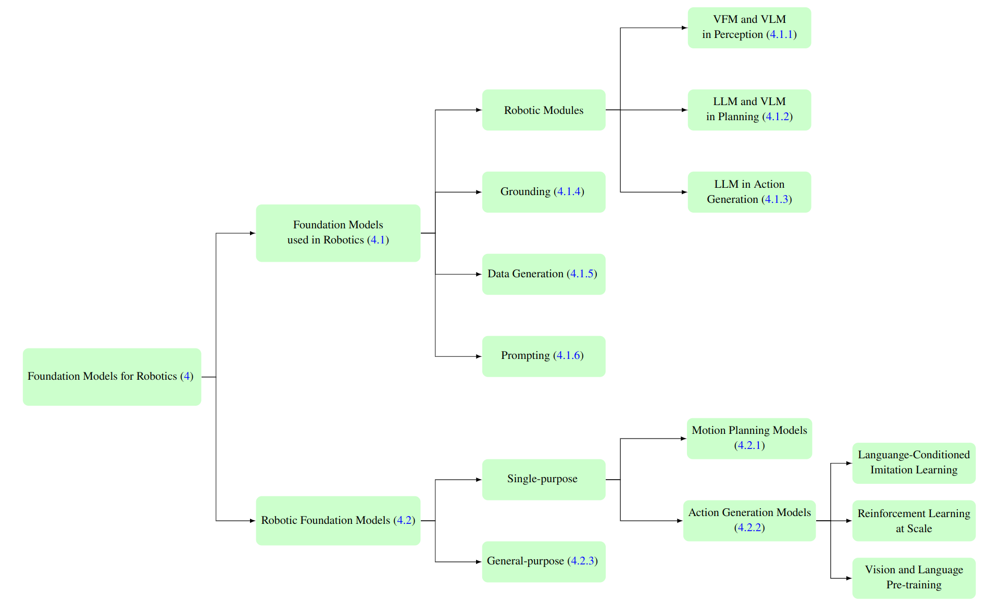

# Paper List in the survey paper
The papers that we are surveying are listed in this file. The papers are grouped by the following categories:
- [Foundation models used in Robotics](#foundation-models-used-in-robotics). For these papers, the authors apply existing vision and language foundation models, such as LLM, VLM, vision FM and text-conditioned image generation models in modules of robotics, such as perception, decision making and planning, and action.

- [Robotic Foundation Models](#robotic-foundation-models). For these papers, the authors propose new foundation models used in one specific robotic applications, such as control using imilation learning and reinforcement learning. We also include genera-purpose foundation models, such as GATO, PALM-E in this category.

The taxonomy is shown in this figure,
<p align="center">

</p>

We list all the papers surveyed in our [paper](https://arxiv.org/abs/2312.08782). The dates are based on the first released date on arxiv. This list will be constantly updated.

NOTE: We only include papers with experiments on real physical robotics, in high-fidelity robotic simulation environments, or using real robotics datasets. 

## Foundation models used in Robotics

### Perception
- CLIPORT **CLIPORT: What and Where Pathways for Robotic Manipulation**, 24 Sep 2021, [paper link](https://arxiv.org/pdf/2109.12098.pdf)
- LM-Nav **LM-Nav: Robotic Navigation with Large Pre-Trained Models of Language, Vision, and Action**, 10 Jul 2022 [paper link](https://arxiv.org/pdf/2207.04429.pdf)
- NLMap **Open-vocabulary Queryable Scene Representations for Real World Planning**, 20 Sep 2022, [Paper Link](https://arxiv.org/pdf/2209.09874.pdf)
- CLIP-Fields **CLIP-Fields: Weakly Supervised Semantic Fields for Robotic Memory**, 11 Oct 2022, [paper link](https://arxiv.org/abs/2210.05663)
- VLMap **Visual Language Maps for Robot Navigation**, 11 Oct 2022, [paper link](https://arxiv.org/pdf/2210.05714.pdf)
- ConceptFusion **ConceptFusion: Open-set Multimodal 3D Mapping**, 14 Feb 2023, [Paper Link](https://arxiv.org/pdf/2302.07241.pdf)
- WVN **Fast Traversability Estimation for Wild Visual Navigation**, 15 May 2023, [paper link](https://arxiv.org/pdf/2305.08510.pdf)
- HomeRobot **HomeRobot: Open-Vocabulary Mobile Manipulation**, 20 Jun 2023, [paper link](https://arxiv.org/pdf/2306.11565.pdf)
- Act3D **Act3D: 3D Feature Field Transformers for Multi-Task Robotic Manipulation**, 30 Jun 2023, [paper link](https://arxiv.org/pdf/2306.17817.pdf)
- F3RM **Distilled Feature Fields Enable Few-Shot Language-Guided Manipulation**, 27 Jul 2023, [paper link](https://arxiv.org/pdf/2308.07931.pdf)
- AnyLoc **Towards Universal Visual Place Recognition**, 1 Aug 2023, [paper link](https://anyloc.github.io/assets/AnyLoc.pdf)
- GNFactor **GNFactor Multi-Task Real Robot Learning with Generalizable Neural Feature Fields**, 31 Aug 2023, [paper link](https://yanjieze.com/GNFactor/CoRL2023_GNFactor.pdf)
- MOSAIC **MOSAIC: Learning Unified Multi-Sensory Object Property Representations for Robot Perception**, 15 Sep 2023, [paper link](https://arxiv.org/pdf/2309.08508.pdf)
- 3D-VisTA **3D-VisTA: Pre-trained Transformer for 3D Vision and Text Alignment**, 8 Aug 2023, [paper link](https://arxiv.org/pdf/2308.04352.pdf)

### Task Planning
<!-- - **Language Models as Zero-Shot Planners: Extracting Actionable Knowledge for Embodied Agents**, 2022 [paper link](https://arxiv.org/pdf/2201.07207.pdf) -->
- **Reshaping Robot Trajectories Using Natural Language Commands: A Study of Multi-Modal Data Alignment Using Transformers**, 25 Mar 2022, [paper link](https://arxiv.org/pdf/2203.13411.pdf)
- Socratic Models **Socratic Models: Composing Zero-Shot Multimodal Reasoning with Language**, 1 Apr 2022, [paper link](https://arxiv.org/abs/2204.00598)
- SayCan **Do As I Can, Not As I Say: Grounding Language in Robotic Affordances**, 4 Apr 2022, [paper link](https://arxiv.org/pdf/2204.01691.pdf)
- **Correcting Robot Plans with Natural Language Feedback**, 11 Apr 2022, [paper link](https://arxiv.org/pdf/2204.05186.pdf)
- Housekeep **Housekeep: Tidying Virtual Households using Commonsense Reasoning**, 22 May 2022, [paper link](https://arxiv.org/pdf/2205.10712.pdf)
- Inner Monologue **Inner Monologue: Embodied Reasoning through Planning with Language Models**, 12 Jul 2022, [paper link](https://arxiv.org/pdf/2207.05608.pdf)
- Code as Policies **Code as Policies: Language Model Programs for Embodied Control**, 16 Sep 2022, [paper link](https://arxiv.org/pdf/2209.07753.pdf)
- ProgPrompt **ProgPrompt: Generating Situated Robot Task Plans using Large Language Models**, 22 Sep 2022, [paper link](https://arxiv.org/abs/2209.11302)
- VIMA **VIMA: General Robot Manipulation with Multimodal Prompts**, 6 Oct 2022, [paper link](https://arxiv.org/pdf/2210.03094.pdf)
- LILAC **“No, to the Right” – Online Language Corrections for Robotic Manipulation via Shared Autonomy**, 6 Jan 2023, [paper link](https://arxiv.org/pdf/2301.02555.pdf) <!-- - **Describe, Explain, Plan and Select: Interactive Planning with Large Language Models Enables Open-World Multi-Task Agents**, 2023, [paper link](https://arxiv.org/pdf/2302.01560.pdf) -->
- ChatGPT for Robotics **ChatGPT for Robotics: Design Principles and Model Abilities**, 20 Feb 2023, [paper link](https://www.microsoft.com/en-us/research/uploads/prod/2023/02/ChatGPT___Robotics.pdf)
- Grounded Decoding **Grounded Decoding: Guiding Text Generation with Grounded Models for Robot Control**, 1 Mar 2023 , [paper link](https://arxiv.org/pdf/2303.00855.pdf)
- TidyBot **TidyBot: Personalized Robot Assistance with Large Language Models**, 9 May 2023, [paper link](https://arxiv.org/pdf/2305.05658.pdf)
- Instruct2Act **Instruct2Act: Mapping Multi-modality Instructions to Robotic Actions with Large Language Model**, 18 May 2023, [paper link](https://arxiv.org/pdf/2305.11176.pdf)
- KNOWNO **Robots That Ask For Help:Uncertainty Alignment for Large Language Model Planners**, 4 Jul 2023, [paper link](https://arxiv.org/pdf/2307.01928.pdf)
- RoCo **RoCo: Dialectic Multi-Robot Collaboration with Large Language Models**, 10 Jul 2023, [paper link](https://arxiv.org/pdf/2307.04738.pdf)
- SayPlan **SayPlan: Grounding Large Language Models using 3D Scene Graphs for Scalable Task Planning**, 12 Jul 2023 , [paper link](https://arxiv.org/pdf/2307.06135.pdf)
- VLP: **Video Language Planning**, 16 Oct 2023 , [paper link](https://arxiv.org/pdf/2310.10625.pdf)
- SuSIE **SuSIE: Subgoal Synthesis via Image Editing**, 2023, [paper link](https://rail-berkeley.github.io/susie/paper.pdf)
- RoboTool **RoboTool: Creative Robot Tool Use with Large Language Models**, 23 Oct 2023, [project link](https://creative-robotool.github.io/)


### Action Generation
- SayTap **SayTap: Language to Quadrupedal Locomotion**, 13 Jun 2023, [paper link](https://arxiv.org/pdf/2306.07580.pdf)
- L2R **Language to Rewards for Robotic Skill Synthesis**, 14 Jun 2023 , [Paper Link](https://arxiv.org/pdf/2306.08647.pdf)
- VoxPoser **VoxPoser: Composable 3D Value Maps for Robotic Manipulation with Language Models**, 12 Jul 2023, [paper link](https://voxposer.github.io/voxposer.pdf)
- ReasonedExplorer **Reasoning about the Unseen for Efficient Outdoor Object Navigation**, 18 Sep 2023, [paper link](https://arxiv.org/pdf/2309.10103.pdf)
- Eureka **Eureka: Human-Level Reward Design via Coding Large Language Models**, 19 Oct 2023, [paper link](https://arxiv.org/pdf/2310.12931.pdf)
- SceneDiffuser **Diffusion-based Generation, Optimization, and Planning in 3D Scenes**, 15 Jan 2023, [paper link](https://arxiv.org/pdf/2301.06015.pdf)

### Data Generation
- CACTI **CACTI: A Framework for Scalable Multi-Task Multi-Scene Visual Imitation Learning**, 12 Dec 2022, [paper link](https://arxiv.org/pdf/2212.05711.pdf)
- ROSIE **Scaling Robot Learning with Semantically Imagined Experience**, 22 Feb 2023 , [paper link](https://arxiv.org/pdf/2302.11550.pdf)
- GenSim **GenSim: Generating Robotic Simulation Tasks via Large Language Models**, 2 Oct 2023, [paper link](https://arxiv.org/pdf/2310.01361.pdf)
- RoboGen **RoboGen: Towards Unleashing Infinite Data for Automated Robot Learning via Generative Simulation**, 2 Nov 2023, [paper link](https://arxiv.org/pdf/2311.01455.pdf)
- RT-Trajectory **RT-Trajectory: Robotic Task Generalization via Hindsight Trajectory Sketches**, 3 Nov 2023, [paper link](https://arxiv.org/pdf/2311.01977.pdf)
- LEO **An Embodied Generalist Agent in 3D World**, 18 Nov 2023, [paper link](https://arxiv.org/pdf/2311.12871.pdf)

## Robotic Foundation Models

### Single-Purpose
#### Action Generation
<!-- - **Pre-Trained Language Models for Interactive Decision-Making**, 2022, [paper link](https://arxiv.org/pdf/2202.01771.pdf) -->
- ZeST **Can Foundation Models Perform Zero-Shot Task Specification For Robot Manipulation?**, 23 Apr 2022 , [paper link](https://arxiv.org/pdf/2204.11134.pdf)
- Behavior Transformers **Behavior Transformers: Cloning k modes with one stone**, 22 Jun 2022, [paper link](https://arxiv.org/pdf/2206.11251.pdf)
- ATLA **Leveraging Language for Accelerated Learning of Tool Manipulation**, 27 Jun 2022, [paper link](https://arxiv.org/pdf/2206.13074.pdf)
- LATTE **LATTE: LAnguage Trajectory TransformEr**, 4 Aug 2022, [paper link](https://arxiv.org/pdf/2208.02918.pdf)
- Perceiver-Actor **Perceiver-Actor: A Multi-Task Transformer for Robotic Manipulation**, 12 Sep 2022, [paper link](https://arxiv.org/pdf/2209.05451.pdf)
- MVP **Real-World Robot Learning with Masked Visual Pre-training**, 6 Oct 2022, [paper link](https://arxiv.org/pdf/2210.03109.pdf)
- GNM **GNM: A General Navigation Model to Drive Any Robot**, 7 Oct 2022 , [Paper Link](https://arxiv.org/pdf/2210.03370.pdf)
- Interactive Language **Interactive Language: Talking to Robots in Real Time**, 12 Oct 2022 , [paper link](https://arxiv.org/pdf/2210.06407.pdf)
- Conditional Behavior Transformers (C-BeT)**From Play to Policy: Conditional Behavior Generation from Uncurated Robot Data**, 18 Oct 2022, [paper link](https://arxiv.org/pdf/2210.10047.pdf)
- STAP **STAP: Sequencing Task-Agnostic Policies**, 21 Oct 2022, [paper link](https://arxiv.org/abs/2210.12250)
- LILA **LILA: Language-Informed Latent Actions**, 31 Oct 2022, [paper link](https://arxiv.org/pdf/2111.03205.pdf)
- DIAL **Robotic Skill Acquisition via Instruction Augmentation with Vision-Language Models**, 21 Nov 2022 , [paper link](https://arxiv.org/pdf/2211.11736.pdf)
- RT-1 **RT-1: Robotics Transformer for Real-World Control at Scale**, Dec 2022, [paper link](https://arxiv.org/pdf/2212.06817.pdf)
- MOO **Open-World Object Manipulation using Pre-Trained Vision-Language Models**, 2 Mar 2023, [paper link](https://arxiv.org/pdf/2303.00905.pdf)
- RC-1 **Where are we in the search for an Artificial Visual Cortex for Embodied Intelligence?**, 31 Mar 2023 , [paper link](https://arxiv.org/pdf/2303.18240.pdf)
- CoTPC **Chain-of-Thought Predictive Control**, 3 Apr 2023 , [paper link](https://arxiv.org/pdf/2304.00776.pdf)
- Optimus **Imitating Task and Motion Planning with Visuomotor Transformers**, 25 May 2023, [paper link](https://arxiv.org/pdf/2305.16309v1.pdf)
- RoboCat **RoboCat: A self-improving robotic agent**, 20 Jun 2023, [paper link](https://arxiv.org/pdf/2306.11706.pdf)
- Scaling Up and Distilling Down **Scaling Up and Distilling Down: Language-Guided Robot Skill Acquisition**, 26 Jul 2023, [paper link](https://arxiv.org/pdf/2307.14535.pdf)
- ViNT **ViNT: A Foundation Model for Visual Navigation**,  26 Jun 2023, [Paper Link](https://arxiv.org/pdf/2306.14846.pdf)
- RT-2 **RT-2: Vision-Language-Action Models Transfer Web Knowledge to Robotic Control**, 28 Jul 2023, [paper link](https://robotics-transformer2.github.io/assets/rt2.pdf)
- RoboAgent **RoboAgent: Generalization and Efficiency in Robot Manipulation via Semantic Augmentations and Action Chunking**, 5 Sep 2023, [paper link](https://arxiv.org/pdf/2309.01918.pdf)   
- RT-X **Open X-Embodiment: Robotic Learning Datasets and RT-X Models**, 13 Oct 2023, [paper link](https://robotics-transformer-x.github.io/paper.pdf)
- Q-Transformer **Q-Transformer: Scalable Offline Reinforcement Learning via Autoregressive Q-Functions**, 18 Sept 2023, [paper link](https://arxiv.org/pdf/2309.10150.pdf)
- **On Bringing Robots Home**, 27 Nov 2023, [paper link](https://arxiv.org/pdf/2311.16098.pdf)
- Octo **Octo: An Open-Source Generalist Robot Policy**, 14 Dec 2023, [paper link](https://octo-models.github.io/paper.pdf)


### General-Purpose
- GATO **A Generalist Agent**, 12 May 2022, [paper link](https://arxiv.org/pdf/2205.06175.pdf)
- PACT **PACT: Perception-Action Causal Transformer for Autoregressive Robotics Pre-Training**, 22 Sep 2022, [paper link](https://arxiv.org/pdf/2209.11133.pdf)
- PALM-E **PaLM-E: An Embodied Multimodal Language Model**, 6 Mar 2023, [paper link](https://arxiv.org/pdf/2303.03378.pdf)
- LEO **An Embodied Generalist Agent in 3D World**, 18 Nov 2023, [paper link](https://arxiv.org/pdf/2311.12871.pdf)

## Related Surveys and repositories
### Robotics surveys
- **Reinforcement Learning in Robotics: A Survey**, 2013, [paper link](https://www.ri.cmu.edu/pub_files/2013/7/Kober_IJRR_2013.pdf)
- **A Review of Robot Learning for Manipulation: Challenges, Representations, and Algorithms**, 2021, [paper link](https://www.jmlr.org/papers/volume22/19-804/19-804.pdf)
- **How to train your robot with deep reinforcement learning: lessons we have learned**, 2021, [paper link](https://arxiv.org/pdf/2102.02915.pdf)

### Foundation models surveys
- **On the Opportunities and Risks of Foundation Models**, 2021, [paper link](https://arxiv.org/pdf/2303.04129.pdf)
- **Foundation Models for Decision Making: Problems, Methods, and Opportunities**, 2023, [paper link](https://arxiv.org/pdf/2301.02555.pdf)
- **Harnessing the Power of LLMs in Practice: A Survey on ChatGPT and Beyond**, 2023, [paper link](https://arxiv.org/pdf/2304.13712.pdf)
- **Challenges and Applications of Large Language Models**, 2023, [paper link](https://arxiv.org/pdf/2307.10169.pdf)
- **A Survey on Large Language Model based Autonomous Agents**, 2023, [paper link](https://arxiv.org/pdf/2308.11432v1.pdf)

### Foundation models and robotics
- **Awesome-LLM-Robotics** [repo link](https://github.com/GT-RIPL/Awesome-LLM-Robotics)
- **Foundation Models in Robotics: Applications, Challenges, and the Future**, 2023, [paper link](https://arxiv.org/pdf/2312.07843.pdf)

## BibTex
If you find our survey paper helpful, please kindly consider citing us:
```
@misc{hu2023robofm,
      title={Toward General-Purpose Robots via Foundation Models: A Survey and Meta-Analysis}, 
      author={Yafei Hu and Quanting Xie and Vidhi Jain and Jonathan Francis and Jay Patrikar and Nikhil Keetha and Seungchan Kim and Yaqi Xie and Tianyi Zhang and Zhibo Zhao and Yu-Quan Chong and Chen Wang and Katia Sycara and Matthew Johnson-Roberson and Dhruv Batra and Xiaolong Wang and Sebastian Scherer and Zsolt Kira and Fei Xia and Yonatan Bisk},
      year={2023},
      eprint={2312.08782},
      archivePrefix={arXiv},
      primaryClass={cs.RO}
}
```

